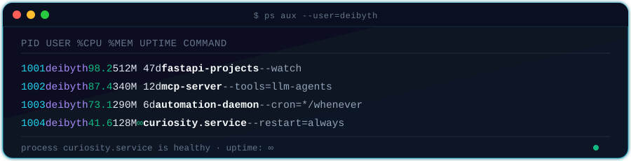

 

### `$ cat about.md`

- 🔭  Desarrollador con enfoque **backend**
- ⚡  Últimamente trabajando con **Python · FastAPI · FastMCP**
- 🔗  Integrando **LLMs, MCP Servers** y herramientas para aumentar productividad
- 🌱  Si puedes imaginarlo, podemos programarlo
- 📝  También he trabajado con **Java, SpringBoot, JavaScript, React, ReactNative**
- 💬  Siempre en busca de nuevas experiencias
- 📫  **deibyth.0322@gmail.com**

 

### `$ ps aux --user=deibyth`

 

### `$ cat stack.json`

 

 

### `$ ./fetch_stats.sh --live`

 

### `$ curl --silent contacts.api`

 

<!---
Deibyth/Deibyth is a ✨ special ✨ repository because its `README.md` (this file) appears on your GitHub profile.
--->
